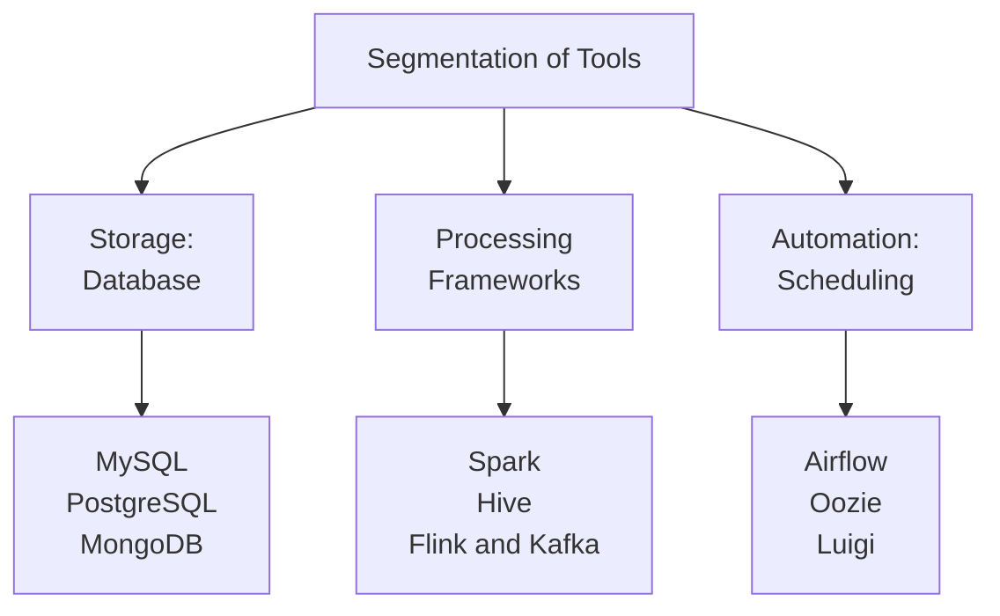
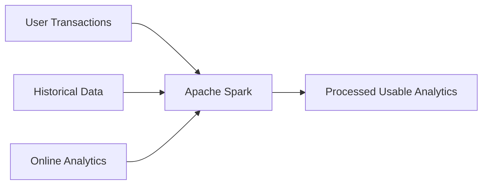
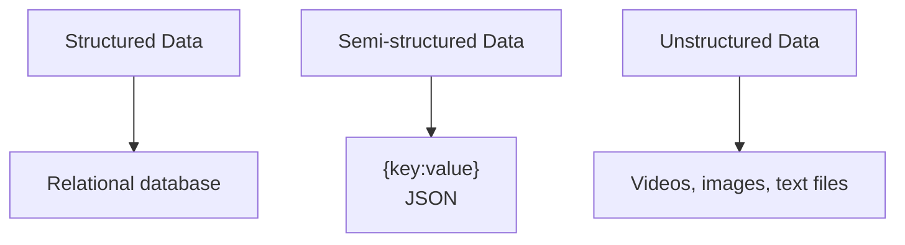
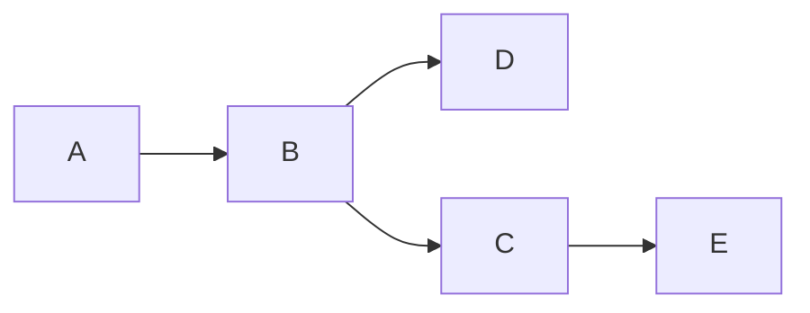
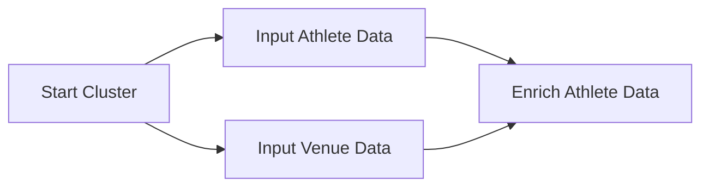

# Resource_Data_Engineering_Foundations

|Table of Sections|
|--|
|[0. Introduction](https://github.com/JefoGao/Resource_Data_Engineering_Foundations/tree/main#0-introduction)<br>+-- [0.1 Introduction To Data Engineering](https://github.com/JefoGao/Resource_Data_Engineering_Foundations/tree/main#01-introduction-to-data-engineering)<br>+-- [0.2 Data Engineer Vs. Data Scientist](https://github.com/JefoGao/Resource_Data_Engineering_Foundations/tree/main#02-data-engineer-vs-data-scientist)<br>+-- [0.3 Essential Tools For Data Engineering](https://github.com/JefoGao/Resource_Data_Engineering_Foundations/tree/main#03-essential-tools-for-data-engineering)<br>[1. Databases And Dataframes](https://github.com/JefoGao/Resource_Data_Engineering_Foundations/tree/main#1-databases-and-dataframes)<br>+-- [1.1 Introduction To Databases And Their Types](https://github.com/JefoGao/Resource_Data_Engineering_Foundations/tree/main#11-introduction-to-databases-and-their-types)<br>+-- [1.2 Understanding Database Schema](https://github.com/JefoGao/Resource_Data_Engineering_Foundations/tree/main#12-understanding-database-schema)<br>+-- [1.3 Distributive Computing](https://github.com/JefoGao/Resource_Data_Engineering_Foundations/tree/main#13-distributive-computing)|

# 1. Introduction
## 1.1 Introduction to Data Engineering
### 1.1.1 Challenges in a Data-driven Organization
- Scattered Data: data is distributed in different sources
- Database Inefficiency: slow and blunt analyses due to inefficient data storage
- Data Corruption: legacy code corrupting files
- Repetitive Work: manual and repetitive tasks that slow you down
### 1.1.2 The Role of a Data Engineer
- Gather data from different sources
- Optimize databases for analyses
- Remove corrupted files and repair the data pipeline
- Automate tasks and pipelines that store data in a suitable format

|**Definition:** Data Engineering|
|:--|
|A type of software engineering that focuses on designing, developing, testing, and maintaining architectures, such as databases and large-scale processing systems.|

### 1.1.3 What Skills Do Data Engineers Need?
- Linux and command line
- Prior programming experience in Python, Java, or Scala
- SQL
- Distributed systems, data ingestion, processing frameworks, storage engines, and tools associated with each

## 1.2 Data Engineer vs. Data Scientist
|Data Engineer|Data Scientist|
|:--:|:--:|
|Develop robust and scalable data architecture|Mine data for patterns|
|Streamline data collection and storage|Model using statistics|
|Clean corrupt data|Clean outliers|
|Comprehend cloud technology|Comprehend predictive modeling using ML|
|Maintain processes for coherent data management|Monitor business processes and metrics|

## 1.3 Essential Tools for Data Engineering
### 1.3.1 Essential Tools

**Databases**
- Used to hold large amounts of data
- Support for applications and analyses
- SQL vs. NoSQL

**Processing Frameworks**
- Data cleaning
- Data aggregation
- Data clustering
- Batch and stream processing

**Automation: Scheduling**
- Set up and manage workflows
- Plan jobs with specific intervals
- Resolve dependency requirements of jobs

### 1.3.2 A Complete Pipeline

# 2. Databases and Dataframes
## 2.1 Introduction to Databases and Their Types
### 2.1.1 What Are Databases?
|**Definition:** Databases|
|:--|
|A large collection of data organized in efficient structures and formats to support rapid search and retrieval|
- Holds data
- Organizes data
- Search data through DBMS
### 2.1.2 Storage: Databases vs. File System
|Databases|File System|
|:--:|:--:|
|Efficiently organized|Less organized|
|Offers functionalities like search, replication, indexing|Offers minimal functionalities|
### 2.1.3 Database Types

### 2.1.4 SQL vs. NoSQL
|SQL|NoSQL|
|:--:|:--:|
|Relational databases|Non-relational databases|
|Database schema|Structured or unstructured|
|Data stored in tables|Document database with key-value stores (JSON objects)|
|Tools: MySQL, PostgreSQL|Tools: Redis, MongoDB|
## 2.2 Understanding Database Schema
|**Definition:** Database Schema|
|:--|
|A schema describes the structure and relations of a database.|
||

**Creating Schema**
```sql
-- create customer table for the food delivery app
CREATE TABLE 'Customer' (
    'id' SERIAL NOT NULL,
    'first_name' varchar(50) NOT NULL,
    'last_name' varchar(50) DEFAULT NULL,
    'email' varchar(50) NOT NULL,
    'password' varchar(50) NOT NULL,
    PRIMARY KEY ('id')
);

-- create order table
CREATE TABLE 'Order' (
    'id' SERIAL NOT NULL,
    'customer_id' integer REFERENCES 'Customer',
    'dish_name' varchar(50) DEFAULT NULL,
    'dish_price' integer NOT NULL,
    PRIMARY KEY ('id')
);
```
|**Definition:** Star Schema|
|:--|
|Consists of one or more fact tables referencing any number of dimension tables|
||
|<ul><li>Facts: events that happened (for example, food orders)</li><li>Dimensions: information in the world (for example, customer details)</li></ul>|
## 2.3 Distributive Computing
### 2.3.1 Major Tasks
- Collect data from different sources
- Join them together
- Clean them
- Aggregate them
### 2.3.2 How It Works
||
|:--|
|Basis of modern data processing tools<ul><li>Memory</li><li>Processing power</li></ul>|
|Methodology<ul><li>Split task into subtasks</li><li>Distribute subtasks on several computers</li></ul>|
### 2.3.3 Benefits and Risks
**Benefits**
- More processing power
- More scalable
- Cost effective

**Risks**
- Overhead due to communication between nodes
- Task needs to be large
- Need several processing units

|**Example:** Olympic Events Data|
|:--|
||
|Get the average age|

**Multiprocessing**
```py
# low-level code
from multiprocessing import Pool

def athlete_avg_age(grouped_data):
    year, group = grouped_data
    return pd.DataFrame({"Age": group["Age"].mean()}, index = [year])

with Pool(4) as p:
    average_age = p.map(athlete_avg_age, df.groupby("Year"))
```

**Using Dask**
```py
# high-level code
import dask.dataframe as dd

##partitioning the data
athlete_df = dd.from_pandas(df, npartitions=4)

##computing the average age of all the athletes
result_df = athlete_df.groupby('Year').Age.mean().compute()
```
# 3. Data Engineering Tools
## 3.1 MapReduce and Hadoop
|Hadoop|MapReduce|
|:--|:--|
|**Hadoop** is a collection of open-source projects, maintained by the Apache Software Foundation.|**MapReduce** is a processing technique and a program model for distributed computing based on Java.|
**Hadoop**
- Framework for distributed processing of large data sets across clusters of computers
- Collection of open-source projects
- Uses the MapReduce algorithm
- Plays a central role in ETL processing

**Hadoop DFS**
- A distributed file system
- Files reside on different computers
- Essential part of the big data ecosystem
- Replaced by cloud-managed storage services like GCS and S3

**Hadoop MapReduce**
- One of the first popularized big data processing paradigms.
- The program splits tasks into sub-tasks, distributing the workload and data between several processing units.
## 3.2 Hive
- Data warehouse software project
- Built on top of Hadoop
- Hive SQL (Structured Query Language)

**Hive SQL**
- Hive gives an SQL-like interface to query data
- Data extraction from databases and file systems that integrate with Hadoop
- Earlier, queries had to be implemented in MapReduce Java API

|How Hive Works|
|:--:|
||
## 3.3 Spark
### 3.3.1 Spark
- Distributes data processing tasks between clusters (computers)
- Processing is done in memory
- Faster processing as it avoids disk writes
- It relied on resilient distributed datasets (RDDs)
### 3.3.2 RDD
- Data structure that maintains data across multiple nodes
- Immutable (read-only), partitioned collection of elements
- Tracks data lineage information to recover lost data
- Supports two types of operations: transformations and actions

|Transformation|Actions|
|:--:|:--:|
|<ul><li>filter()</li><li>map()</li><li>groupByKey()</li><li>union()</li></ul>|<ul><li>count()</li><li>first()</li><li>collect()</li><li>reduce()</li></ul>|
### 3.3.3 PySpark
- Python API for Spark
- DataFrame abstraction
- Similar to pandas because of the DataFrame abstraction

||
|:--:|
|PySpark Analogous of SQL|
## 3.4 Airflow
### 3.4.1 Directed Acyclic Graph (DAG)
- A collection of all the tasks that need to be run, organized in a way that reflects their relationship and dependencies
- Set of nodes
- Directed edges
- There are no cycles

### 3.4.2 Workflow Scheduler Tools
- Linux - cron
- Spotify - Luigi
- Apache - Airflow

### 3.4.3 Airflow
- Tool for describing, executing, and monitoring workflows or pipelines
- Based on DAGs
- Written in Python

**Coding DAGs**
```py
dag = DAG('my_dag', start_date=datetime(2020, 12, 1))

##define tasks of the DAG
start_cluster = StartClusterOperator(task_id="start_cluster", dag=dag)
input_athlete_data = SparkJobOperator(task_id="input_athlete_data", dag=dag)
input_venue_data = SparkJobOperator(task_id="input_venue_data", dag=dag)

##set up dependency flow
start_cluster.set_downstream(input_athlete_data)
input_athlete_data.set_downstream(enrich_athlete_data)
input_venue_data.set_downstream(enrich_athlete_data)
```
# 4. ETL Pipeline
## 4.1 Sources of Data Extraction
||
|:--|
|Extracting data from various sources|
### 4.1.1 Data from Files
**Unstructured**
- Plain text
- For example, extracting numbers from documents

**Flat files**
- Row is record
- Column is attribute or feature
- For example, .csv or .tsv files

### 4.1.2 JSON
- JavaScript Object Notation
- Semi-structured
- Atomic: number, string, bool, null
- Composite: array, object
```
{
    "food": {
        "vegetables": [
            "carrot",
            "potato",
            "reddish"
        ],
        "fruits":[
            "apple",
            "banana",
            {"berries": ["strawberry", "blackberries"]}
        ]
    }
}
```
### 4.1.3 Data through APIs
- Application programming interface
- Send data in JSON format
- For example, Twitter API, TMDb API, Google APIs
```py
response = requests.get('https://api.themoviedb.org/3/discover/movie?api_key=' +
                    api_key + '&primary_release_year=2017&sort_by=revenue.desc')

response.json()
```
### 4.1.4 Data from Databases
|Online Transaction Processing (OLTP)|Online Analytical Processing(OLAP)|
|--|--|
|<ul><li>Application databases</li><li>Many transactions</li><li>Row oriented</li><li>Stored per record</li></ul>|<ul><li>Analytical database</li><li>Aggregate queries</li><li>Column oriented</li><li>Parallelization</li></ul>|

## 4.2 Data Extraction from a PostgreSQL Database
|Movie Ratings Example|
|--|
||
|database|
||
|check the data|
||
|check the data using PySpark|

## 4.3 Transforming Data
||
|--|
|read user table, transforming data, and join movies and avg_ratings|
## 4.4 Loading Data into a DB
- Transform the above steps into functions to make them reusable
- Load transformed dataframe to the database

||
|--|
||
|create workflow|
## 4.5 Scheduling ETL Pipeline Using Airflow
|dags.py|
|--|
||
||
