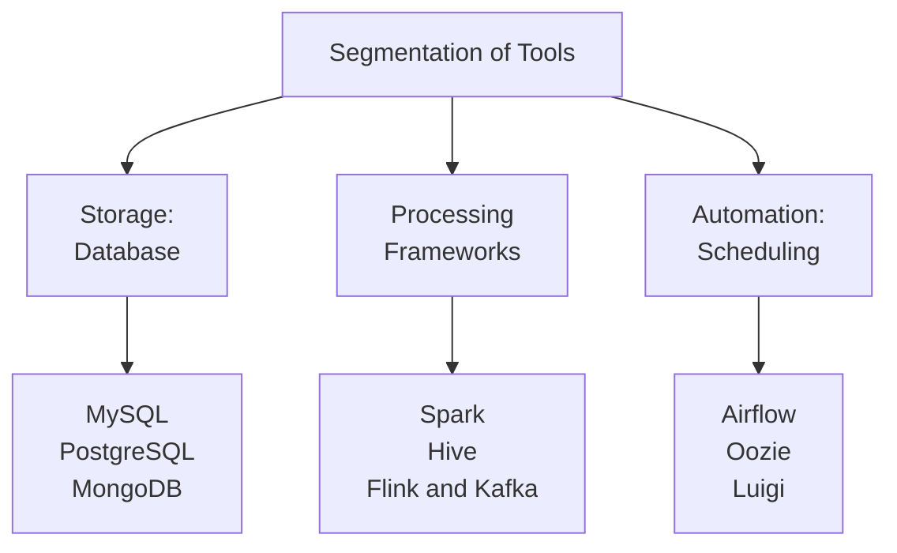
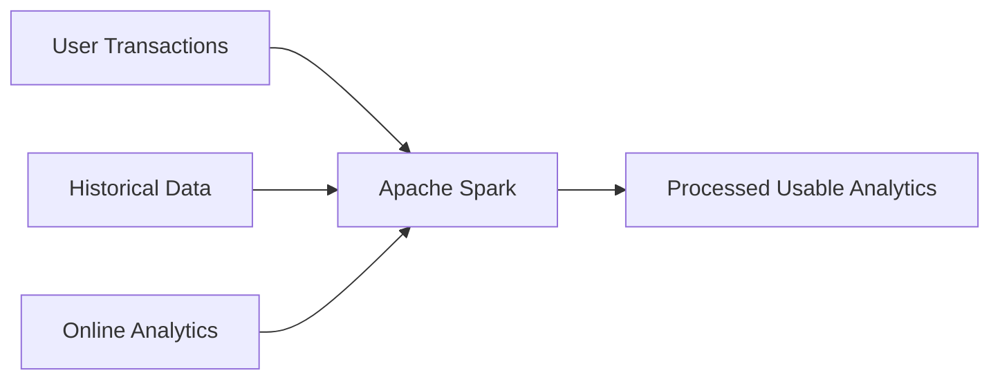

# Resource_Data_Engineering_Foundations

## 0.1 Introduction to Data Engineering
### 0.1.1 Challenges in a Data-driven Organization
- Scattered Data: data is distributed in different sources
- Database Inefficiency: slow and blunt analyses due to inefficient data storage
- Data Corruption: legacy code corrupting files
- Repetitive Work: manual and repetitive tasks that slow you down
### 0.1.2 The Role of a Data Engineer
- Gather data from different sources
- Optimize databases for analyses
- Remove corrupted files and repair the data pipeline
- Automate tasks and pipelines that store data in a suitable format

|**Definition: Data Engineering**|
|:--|
|A type of software engineering that focuses on designing, developing, testing, and maintaining architectures, such as databases and large-scale processing systems.|

### 0.1.3 What Skills Do Data Engineers Need?
- Linux and command line
- Prior programming experience in Python, Java, or Scala
- SQL
- Distributed systems, data ingestion, processing frameworks, storage engines, and tools associated with each

## 0.2 Data Engineer vs. Data Scientist
|Data Engineer|Data Scientist|
|:--:|:--:|
|Develop robust and scalable data architecture|Mine data for patterns|
|Streamline data collection and storage|Model using statistics|
|Clean corrupt data|Clean outliers|
|Comprehend cloud technology|Comprehend predictive modeling using ML|
|Maintain processes for coherent data management|Monitor business processes and metrics|

## 0.3 Essential Tools for Data Engineering
### 0.3.1 Essential Tools

**Databases**
- Used to hold large amounts of data
- Support for applications and analyses
- SQL vs. NoSQL

**Processing Frameworks**
- Data cleaning
- Data aggregation
- Data clustering
- Batch and stream processing

**Automation: Scheduling**
- Set up and manage workflows
- Plan jobs with specific intervals
- Resolve dependency requirements of jobs

### 0.3.2 A Complete Pipeline

